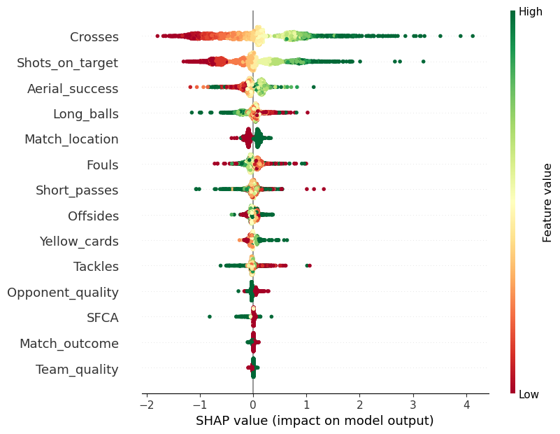

# Summary

Feature selection plays a significant role in machine learning and data mining. Firstly, it can improve model performance by removing irrelevant or redundant features, reducing overfitting risk, and enhancing prediction accuracy. Secondly, feature selection can reduce computation costs by reducing the number of features to be processed, lowering computational complexity[@caiFeatureSelectionMachine2018]. Additionally, feature selection helps improve model interpretability by selecting task-relevant features, making the model more understandable and interpretable[@chandrashekarSurveyFeatureSelection2014]. Furthermore, feature selection can enhance model robustness by selecting stable and unrelated features, reducing the impact of noise and outlier data on the model. Lastly, feature selection can provide domain knowledge guidance, helping to build models that are more interpretable and meaningful in practical business scenarios. In summary, feature selection plays a crucial role in achieving high-performance machine learning models[@dash1997].

SHAP (SHapley Additive exPlanations) values, as a method for explaining machine learning model predictions, play an important role in feature selection. By calculating the SHAP values for each feature, the contribution of each feature to the model's prediction can be evaluated. This can help identify and select the most important features, achieving the goal of feature selection[@juraevMultilayerDynamicEnsemble2022]. SHAP values can also help explain the interactions and influences between features, revealing complex relationships between features. Additionally, SHAP values can be used to build models that are highly interpretable, enhancing model interpretability and comprehensibility[@yePredictingObjectiveSubjective2022]. The application of SHAP values in feature selection can provide targeted feature selection strategies, helping to reduce feature dimensionality, lower computation costs, and improve model performance and robustness[@marcilio-jrExplainingDimensionalityReduction2021]. In summary, SHAP values play an important role in feature selection, providing effective explanations and guidance for feature selection in machine learning models.

Therefore, we have built a Python package for feature selection using SHAP values, utilizing libraries such as Numpy, Shap, Matplotlib, etc. This package is easy to use, simply by creating a feature_selection class and fitting the data, variable selection can be performed seamlessly.

# Implementation

We take the data from a soccer match as an example for feature selection. This data has a total of 14 features. After using shapfs package for feature selection, we can see that 6 important variables are selected, namely Crosses, Shots_on_target, Aerial_success, Long_balls, Match_location, and Fouls. These variables are obviously the most important in soccer matches. We can use the built-in plotting functions in the shapfs package to plot the feature importance (Figure 1) and the feature beeswarm (Figure 2).

Figure 1: The feature imprtance, where the abscissa is the name of each feature and the ordinate is the importance of each feature.

Figure 2: The feature beeswarm, where the variable with the larger SHAP value is the most important.

# References
